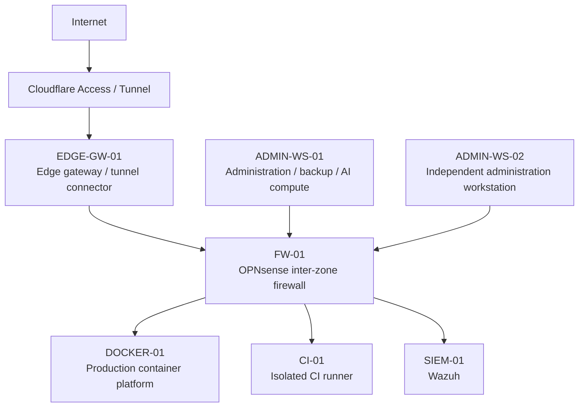

  

<h1 align="center">Homelab Security Portfolio</h1>

  <strong>Nuclear-grade cybersecurity engineering in a segmented homelab and cyber range.</strong>

  Network Segmentation • Zero Trust • DevSecOps • Recovery • SIEM • Local AI • ICS/OT

  
  
  

A sanitized public documentation set derived from a privately operated, security-focused homelab, DevOps platform, local AI environment, and ICS/OT cyber-range program.

> **Publication note:** Hostnames, IP addresses, DNS names, account identities, filesystem paths, and other operational identifiers in this repository are intentionally substituted or generalized. Architectural relationships, security controls, engineering decisions, validation methods, and lessons learned are preserved where they provide technical value.

## Project Purpose

This project documents the design and operation of a small enterprise-inspired lab environment built around:

- segmented network zones enforced by OPNsense;
- zero public router ports;
- Cloudflare Access and Tunnel for protected ingress;
- a production-style Docker application platform;
- Git-managed infrastructure and isolated CI/CD;
- controlled production reconciliation rather than unrestricted deployment access;
- independent backup and recovery using Restic;
- Wazuh-based security monitoring;
- Windows and Linux administrative workflows;
- a constrained local-AI boundary with read-only knowledge access;
- planned ICS/OT and Red Team zones that remain explicitly separated from implemented workloads.

The objective is not to present a generic collection of self-hosting tutorials. The documentation emphasizes trust boundaries, least privilege, recoverability, validation, and controlled change.

## Current Architecture

This diagram is intentionally simplified. The firewall remains the authoritative inter-zone routing boundary. Administrative, production, CI, security-monitoring, and future cyber-range zones are treated as distinct trust domains.

## Core Design Principles

1. **Runtime evidence outranks stale documentation.**
2. **Least privilege and segmentation are default design assumptions.**
3. **No public router ports are required for application or administrative ingress.**
4. **Git stores configuration, not runtime state or secrets.**
5. **CI is treated as untrusted remote-code-execution infrastructure.**
6. **Backups must exist outside the production failure domain.**
7. **AI is a separate trust boundary and does not receive unrestricted infrastructure control.**
8. **Risky changes require validation and rollback capability before cleanup.**
9. **Positive and negative security tests are both part of acceptance.**

See [Security Design Principles](docs/architecture/security-design-principles.md).

## Sanitized Network Model

The public documentation preserves VLAN numbers and security-zone purposes but uses documentation-only addressing.

| VLAN | Public subnet | Purpose | Public state |
|---:|---|---|---|
| 10 | `10.100.10.0/24` | Trusted | Configured |
| 20 | `10.100.20.0/24` | Applications / Docker | Active |
| 30 | `10.100.30.0/24` | ICS / OT | Zone configured; workload maturity documented separately |
| 40 | `10.100.40.0/24` | Red Team | Zone configured; exercise workload remains program work |
| 50 | `10.100.50.0/24` | IoT / Guest | Configured |
| 60 | `10.100.60.0/24` | AI | Target placement; current AI runtime is not claimed to reside here |
| 70 | `10.100.70.0/24` | CI | Active |
| 95 | `10.100.95.0/24` | OT DMZ | Configured |
| 99 | `10.100.99.0/24` | Management / Security | Active |

See [Network Segmentation](docs/architecture/network-segmentation.md).

## Representative Security Controls

- OPNsense as the authoritative inter-zone firewall.
- Narrow source/destination/port exceptions rather than broad east-west access.
- Cloudflare Access/Tunnel with zero public router ports.
- Caddy used as the normal application reverse proxy without a Docker socket mount.
- CI isolated from the production Docker socket and constrained to controlled deployment paths.
- Production changes preceded by independent backup and followed by health validation.
- Encrypted SMB transport for the external backup tier.
- Restic retention and isolated restore testing.
- Wazuh agent and syslog collection through narrow network policy.
- Windows OpenSSH with independently revocable workstation identities.
- Local AI services bound to loopback with read-only MCP access to approved knowledge roots.

## Current Maturity

### Current / verified

- segmented OPNsense VLAN architecture;
- production Docker and reverse-proxy path;
- Cloudflare-protected ingress;
- Forgejo/GitOps workflow and isolated CI;
- independent Restic-backed recovery tier;
- Wazuh operational foundation;
- multi-workstation administrative model;
- Windows-native local AI with loopback-only model/dashboard listeners;
- read-only knowledge MCP boundary.

### Current with open hardening or maturity work

- selected SSH server-side hardening;
- broader firewall reconciliation and policy hardening;
- Wazuh recovery, retention/capacity, tuning, and notifications;
- Docker reproducibility and selected runtime drift;
- observability modernization.

### Planned / not claimed as implemented

- final Grafana/Prometheus observability architecture;
- full ICS/OT cyber-range implementation;
- Red Team exercise integration;
- migration of local AI into the dedicated VLAN60 trust zone;
- semantic RAG/vector retrieval finalization.

## Repository Navigation

### Architecture

- [Architecture Overview](docs/architecture/architecture-overview.md)
- [Network Segmentation](docs/architecture/network-segmentation.md)
- [Trust Boundaries](docs/architecture/trust-boundaries.md)
- [Security Design Principles](docs/architecture/security-design-principles.md)

### Stable Technical Domains

- [Zero Trust Ingress](docs/platform/zero-trust-ingress.md)
- [GitOps and Isolated CI/CD](docs/devops/gitops-ci-cd.md)
- [Backup and Recovery Architecture](docs/recovery/backup-recovery-architecture.md)
- [SSH Trust Model](docs/security/ssh-trust-model.md)
- [Wazuh SIEM Architecture](docs/security/wazuh-siem.md)
- [Local AI Security Boundary](docs/security/local-ai-security-boundary.md)

Additional validated case studies and technical domains will be added as the underlying environment evolves.

## Case Studies

- [Case Study Index](case-studies/README.md)
- [Backup Migration](case-studies/backup-migration/README.md) — completed move from same-host protection to an encrypted, fail-closed external Restic tier with restore validation.
- [Wazuh Integration](case-studies/wazuh-integration/README.md) — segmented SIEM deployment, OPNsense `reply-to` troubleshooting, agent telemetry, and firewall-log integration.
- [Observability Modernization](case-studies/observability-modernization/README.md) — pre-modernization baseline and migration framework; validated `after` state intentionally withheld pending implementation.

## Architecture Decision Records

- [Architecture Decision Record Index](adrs/README.md)
- [Public Documentation Governance](docs/governance/documentation-governance.md)

## Portfolio Summaries

- [Project Summary](portfolio/project-summary.md)
- [Skills Demonstrated](portfolio/skills-demonstrated.md)
- [Project Evolution](portfolio/project-evolution.md)
- [LinkedIn / Portfolio Source Material](portfolio/linkedin-source-material.md)

## Sanitized Examples

- [Examples Index](examples/README.md)
- [Diagram Sources](diagrams/README.md)

## Release and Publication

- [Publication Checklist](PUBLICATION-CHECKLIST.md)
- [Public Documentation Governance](docs/governance/documentation-governance.md)
- [Publication Readiness Review](docs/governance/publication-readiness-review.md)
- [Changelog](CHANGELOG.md)
- [Release Notes 1.0.0](RELEASE-NOTES-1.0.0.md)

## Automated Documentation QA

Every pull request and every push to `main` runs a documentation-quality workflow that checks:

- known private/live infrastructure identifiers;
- common secret patterns;
- broken relative Markdown links;
- required public portfolio paths;
- public lifecycle/front-matter status values;
- trailing whitespace;
- Markdown structure and style.

The repository-owned validator is [scripts/validate_publication.py](scripts/validate_publication.py), and the workflow is defined in [.github/workflows/docs-quality.yml](.github/workflows/docs-quality.yml).

## Technologies

Representative technologies include OPNsense, Proxmox, Docker, Caddy, Cloudflare Access/Tunnel, Forgejo, Forgejo Actions, Restic, SMB 3.1.1, systemd, Wazuh, Windows OpenSSH, Ollama, Hermes, and a custom read-only MCP service.

## Scope

This repository is a professional portfolio and engineering reference. It is not a live infrastructure inventory, disaster-recovery secret store, or operational credential source. Example values must not be interpreted as current production endpoints.
