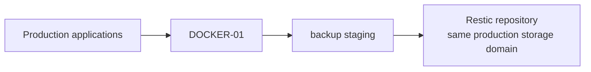

# Backup Migration — From Same-Host Protection to an Independent Recovery Tier

> **State:** Completed migration. The current production architecture uses an external Windows-hosted backup tier and the former same-host repository is retained only as governed rollback evidence.

## Executive Summary

The original Docker backup design protected application state with Restic but kept the authoritative repository inside the same production-storage failure domain.

That provided versioning, but not sufficient disaster recovery.

The migration moved authoritative application-aware backup staging and Restic storage to an external Windows-hosted tier reached through a dedicated backup network identity, narrow firewall policy, encrypted SMB 3.1.1 transport, fail-closed mount validation, and isolated restore testing.

The key engineering outcome was not "moving files to another machine." It was changing the meaning of a successful backup:

```text
before:
backup succeeded -> data existed somewhere on production storage

after:
backup succeeded -> the expected independent tier was mounted,
                    encrypted,
                    source-bound,
                    validated,
                    snapshotted,
                    and recoverable
```

## Problem

The previous design had an architectural weakness:

```text
production application state
        +
authoritative Restic repository
        ↓
same production storage failure domain
```

Restic still protected against logical errors and provided historical snapshots, but a sufficiently severe production-host or storage-tier failure could remove both the workload and its primary recovery repository.

The goal was to separate the authoritative backup path without redesigning the application platform itself.

## Constraints

The migration had to preserve several existing controls:

- production applications could not be deleted or re-created merely to simplify the migration;
- the Docker host had to retain its normal production network identity;
- SMB access could not be opened to the entire application VLAN;
- backup credentials had to remain outside Git;
- backup workflows had to fail rather than silently write to local disk;
- PostgreSQL-backed applications required logical database dumps;
- the previous repository had to remain available as rollback evidence during the migration window;
- the final design required a successful restore test, not merely a successful snapshot.

## Before



The weakness was failure-domain coupling, not the use of Restic itself.

## Design Decision

The authoritative repository was moved to a separate Windows-hosted storage tier on `ADMIN-WS-01`.


The backup tier is independent from the **production Docker storage failure domain**. It is not described as an independent geographic site because the Windows host also carries other administrative roles.

## Dedicated Backup Network Identity

`DOCKER-01` uses a dedicated backup-only network identity in addition to its normal production identity.

The backup identity exists so network policy can express:

```text
backup-only source
  -> backup endpoint
  -> TCP/445
```

instead of:

```text
entire application VLAN
  -> Windows file sharing
```

Normal application, administrative, reverse-proxy, and Internet traffic continues to use the production identity.

## Narrow Firewall Policy

The required path is intentionally specific:

| Source | Destination | Port | Purpose |
|---|---|---:|---|
| `DOCKER-01` backup identity | backup tier | TCP/445 | encrypted SMB backup |

The rule is an exception for a defined infrastructure dependency, not general application-zone access to the Windows host.

## Encrypted SMB Transport

The Linux client requires:

```text
SMB 3.1.1
encryption/sealing
dedicated source identity
root-only credentials
nosuid
nodev
noexec
systemd automount
```

The Windows side uses a dedicated noninteractive service identity with access limited to the backup share.

Credentials remain outside Git and are not exposed in the public portfolio.

## Fail-Closed Mount Validation

One of the most important controls is the pre-backup mount guard.

The guard verifies that the path is actually the intended external backup tier by checking properties such as:

- the expected remote source;
- CIFS filesystem type;
- expected mount point;
- dedicated source address;
- SMB version;
- encryption;
- a sentinel that identifies the correct backup root.

The intended behavior is:

```text
correct external mount
    -> backup may proceed

wrong / missing / insecure mount
    -> backup stops
```

The Docker host must never interpret an ordinary local directory as a successful external backup target.

## Application-Aware Staging

The migration retained application-consistency requirements rather than reducing backup to a filesystem copy.

The current pattern includes:

- application configuration and state archives;
- PostgreSQL logical dumps for database-backed services;
- Forgejo-aware backup handling;
- application-specific capture where required;
- SHA-256 integrity manifests;
- completion-marker validation before the set is treated as complete.

Raw staging is temporary. Restic provides versioned retention.

## Repository Migration and Rollback

The former same-host Restic repository was not immediately deleted.

During migration it was treated as:

```text
frozen rollback repository
```

It was no longer a production backup target and did not receive normal backup, forget, prune, or initialization operations.

This separated **rollback preservation** from **active backup authority**.

## Validation

The migration exit criteria required more than a mounted share.

Validation included:

```text
dedicated backup identity present
normal production routing preserved
narrow TCP/445 policy confirmed
SMB encryption confirmed
mount guard passes against the intended tier
mount guard fails against invalid conditions
application-aware staging completes
integrity manifest validates
Restic repository check succeeds
manual backup succeeds
scheduled backup succeeds
historical snapshots remain available
isolated restore test succeeds
```

The full backup-and-restore test was the acceptance point for the new recovery tier.

## Operational Outcome

The current recovery chain is:

```text
application state
  -> application-aware staging
  -> integrity validation
  -> encrypted external transport
  -> Restic snapshot
  -> retention maintenance
  -> isolated restore validation
```

## Lessons Learned

### A backup path needs identity

Using a dedicated source address made the network policy substantially narrower and easier to audit.

### A mount point is not proof of an external backup

A directory can exist even when the external filesystem is absent. Fail-closed validation prevents a dangerous false-success condition.

### Encryption and least privilege belong in recovery architecture

Backup systems contain concentrated application data. SMB encryption, service-account restriction, root-only credentials, and narrow firewall rules are part of the security design, not optional storage details.

### Restore testing is the acceptance criterion

A snapshot proves that backup software wrote data. A restore test proves that the recovery chain can return usable artifacts.

### Rollback evidence should not become a second production path

The frozen old repository was useful during migration, but keeping it frozen prevented the environment from quietly reverting to two competing backup authorities.

## Related Documentation

- [Backup and Recovery Architecture](../../docs/recovery/backup-recovery-architecture.md)
- [Trust Boundaries](../../docs/architecture/trust-boundaries.md)
- [Security Design Principles](../../docs/architecture/security-design-principles.md)
- [ADR-0006: Independent Backup Failure Domain](../../adrs/0006-independent-backup-failure-domain.md)
