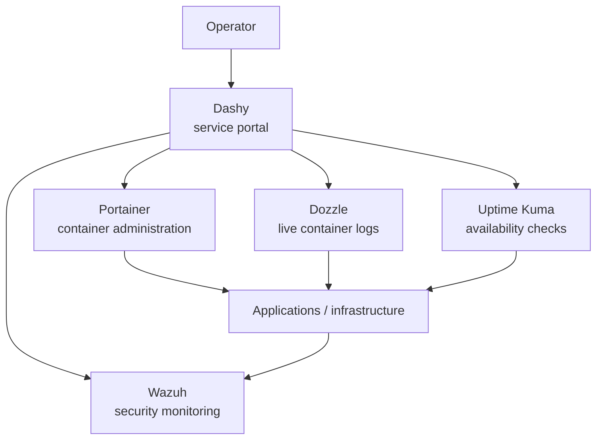

# Before — Pre-Observability Baseline

> **Status:** Current verified baseline captured for future comparison. Once the modernization is validated, this document becomes the **Historical Baseline / Pre-Observability Architecture**. It must not be maintained as a competing current architecture.

## Purpose

This document captures the monitoring-related Docker state before Grafana/Prometheus modernization.

It intentionally records architecture and component roles rather than pretending that unmeasured resource or performance values are known.

## Baseline Docker Estate

The current validated production estate contains ten containers:

```text
Caddy
Portainer
Dozzle
Uptime Kuma
Dashy
Actual Budget
Linkwarden
PostgreSQL
Meilisearch
Forgejo
```

All ten were classified as active and healthy in the latest broad Docker audit available to the publishing project.

## Relevant Container Roles

### Caddy

Role:

```text
application reverse proxy
```

Caddy is not an observability platform.

Important security properties:

- normal application HTTP publisher;
- attached only to required Docker networks;
- admin API disabled;
- no Docker-socket mount.

### Portainer

Role:

```text
container administration
```

Portainer is a privileged management tool, not a metrics backend.

Its Docker-socket access is an explicit accepted exception.

Modernization implication:

```text
Grafana does not replace Portainer.
```

### Dozzle

Role:

```text
live Docker log viewing
```

Dozzle provides immediate operational convenience.

Its presence does not imply a full centralized logging architecture.

Modernization implication:

```text
Do not deploy a logging platform merely to justify removing Dozzle.
```

### Uptime Kuma

Role:

```text
lightweight service availability / synthetic monitoring
```

Uptime Kuma is a candidate for later consolidation only if replacement probes and alerting are demonstrated to be equal or better.

### Dashy

Role:

```text
service portal / homepage
```

Dashy is intentionally different from an observability dashboard.

Target relationship if Grafana is later adopted:

```text
Dashy
  -> Grafana
  -> Wazuh
  -> Portainer
  -> Forgejo
  -> service monitoring
  -> other applications
```

Dashy remains the primary launchpad unless a future decision explicitly changes that role.

### Wazuh

Role:

```text
SIEM / endpoint and security telemetry
```

Wazuh is operational outside the Docker monitoring stack.

Modernization implication:

```text
Grafana does not replace Wazuh.
```

Selected Wazuh operational/security summaries may eventually be visualized elsewhere, but Wazuh remains the authoritative security-analysis platform.

## Existing Docker Network Model

The public sanitized network model is:

| Network | Public subnet | Role |
|---|---|---|
| `infra_net` | `172.30.10.0/24` | Infrastructure/platform services |
| `apps_net` | `172.30.20.0/24` | Application/reverse-proxy connectivity |
| `data_net` | `172.30.30.0/24` | Database/data services |

Typical baseline placement:

```text
infra_net
  Caddy
  Portainer
  Dozzle
  Uptime Kuma

apps_net
  Caddy
  Dashy
  Actual Budget
  Linkwarden
  Forgejo

data_net
  PostgreSQL
  data-dependent applications
```

Actual production membership remains governed by the private current Compose definitions; the public topology is deliberately sanitized.

## Current Monitoring Model

The baseline is a collection of focused operational tools rather than a centralized metrics platform.



This baseline provides useful visibility, but it does not establish a single metrics/query model for infrastructure trends, capacity, cross-system dashboards, or SLI/SLO-style analysis.

## Current Security Boundaries

The baseline already enforces several constraints that the modernization must preserve:

- no arbitrary public host-port publication;
- Caddy remains the normal application HTTP publisher;
- OPNsense remains the inter-zone authority;
- Docker socket access is treated as host-equivalent privilege;
- accepted Docker-socket exceptions are limited;
- CI does not receive the production Docker socket;
- Wazuh remains a separate security platform.

## Evidence Not Yet Captured

The observability execution plan requires a measured pre-change baseline before any installation or removal.

The following values are therefore intentionally **not invented** in this public baseline:

```text
steady-state Docker host CPU
steady-state Docker host RAM
per-container CPU
per-container RAM
per-container storage
Uptime Kuma check inventory
actual current monitoring coverage by host
existing metrics/exporter endpoints
cross-VLAN metrics reachability
observability-related firewall flows
```

These values must come from a controlled runtime audit.

## Baseline Acceptance

Before modernization, capture and retain:

- container inventory and health;
- current resource usage;
- current Docker socket mounts;
- Uptime Kuma checks;
- Dashy service links;
- Dozzle operational role;
- Portainer operational role;
- Caddy routes;
- available Docker storage and memory;
- existing metrics endpoints;
- firewall restrictions between candidate collectors and monitored systems.

That evidence becomes the quantitative "before" side of the eventual before/after comparison.

## Related Documentation

- [Observability Modernization](Publishing/Homelab-security-portfolio/case-studies/observability-modernization/README.md)
- [Architecture Decision Framework](architecture-decision.md)
- [Migration and Validation Plan](migration.md)
- [Zero Trust Ingress](../../docs/platform/zero-trust-ingress.md)
- [Wazuh SIEM Architecture](../../docs/security/wazuh-siem.md)
