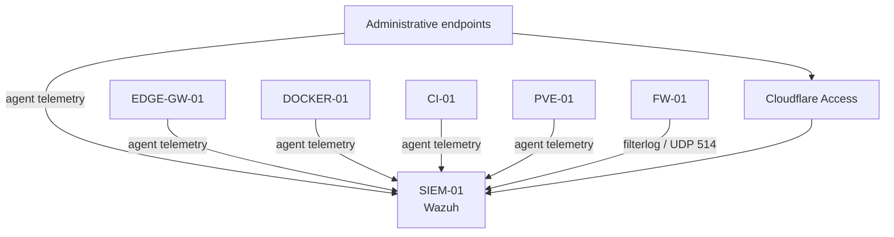

# Wazuh Integration — Central Security Telemetry Without Flattening the Network

> **State:** Operational monitoring baseline established. Recovery, retention/capacity, alert tuning, notifications, and selected hardening remain open maturity work.

## Executive Summary

The Wazuh project added centralized endpoint and firewall telemetry to a network that was already intentionally segmented.

The objective was not simply to make agents "connect." The integration had to preserve OPNsense as the inter-zone firewall, keep the SIEM out of the production routing path, avoid broad management-zone access, maintain the CI security boundary, and provide protected remote administration without public router ports.

The most important troubleshooting issue appeared on the lab transit network: OPNsense `reply-to` behavior forced return traffic for some same-transit-subnet Wazuh connections toward the configured WAN gateway instead of directly back to the source.

The correction was a **per-rule `Disable reply-to` exception** for the affected Wazuh rules—not a global firewall-policy workaround.

## Problem

The environment needed a central security-monitoring platform capable of receiving:

- endpoint-agent telemetry;
- Linux and Windows host security data;
- CI and production-host telemetry;
- hypervisor telemetry;
- OPNsense firewall logs;
- protected administrative access.

The challenge was that those sources exist across multiple routing domains.

A monitoring project could easily become an excuse to add broad access into the management zone. That outcome was explicitly rejected.

## Design Constraints

The integration had to preserve these properties:

```text
FW-01 remains the inter-zone firewall
SIEM-01 is not inline in production routing
zero public router ports remain
Wazuh does not use the production Caddy application path
CI does not become a bastion or gain new production authority
agent rules remain source-specific
future VLANs do not receive broad pre-authorized SIEM access
```

## Architecture

`SIEM-01` was placed in the dedicated management/security zone and hosted on the existing Hyper-V administration platform.



Wazuh is a telemetry consumer, not a routing or enforcement replacement for OPNsense.

## Narrow Telemetry Policy

Agent communication uses the required Wazuh ports:

```text
TCP/1514  agent communication
TCP/1515  enrollment/authentication
```

Rules are defined for approved sources rather than as a whole-network `any -> SIEM` exception.

OPNsense firewall logs are forwarded separately:

```text
OPNsense filterlog
  -> SIEM-01
  -> UDP/514
```

The built-in Wazuh `pf` decoder was validated against live OPNsense events.

## Protected Administration

Wazuh administration uses dedicated Cloudflare Access-protected paths for:

- dashboard access;
- SSH administration.

The dashboard does not traverse the normal Docker/Caddy application path.

This keeps the SIEM's privileged administration surface separate from the ordinary application tier while retaining zero public router ports.

## Defense in Depth

The Wazuh host also uses a host firewall with default-deny inbound behavior and narrow permits.

This does not replace OPNsense. It adds a second policy boundary around a high-value management workload.

## The `reply-to` Failure

### Symptom

Some Wazuh connections originating from systems on the same transit subnet as the OPNsense WAN interface failed even though:

- addressing was correct;
- forward routing existed;
- the Wazuh listener was active;
- the firewall rule appeared to permit the flow.

### Investigation

The troubleshooting sequence stayed at the network-dependency layer:

```text
source addressing
route selection
OPNsense rule
packet return path
service listener
host firewall
```

The failure was not solved by widening the firewall or moving Wazuh into a less restricted zone.

### Root Cause

OPNsense was observed applying WAN `reply-to` behavior to the affected Wazuh rules.

For sources located on the same transit subnet as the OPNsense WAN interface, SYN-ACK return traffic was being forced toward the configured WAN gateway instead of directly back to the originating transit host.

```text
source on transit subnet
        -> FW-01
        -> SIEM-01

SIEM-01 response
        -> FW-01
        -> reply-to forces wrong next hop
        -> connection fails
```

### Resolution

The correction was deliberately narrow:

```text
Disable reply-to
```

was enabled only on the affected Wazuh rules sourced from the same transit network.

The design specifically avoided:

```text
global Disable reply-to
broad NAT workarounds
any -> management rules
moving SIEM-01 into the transit network
```

This preserved the firewall architecture while fixing the actual return-path behavior.

## Firewall-Log Integration

OPNsense forwards `filterlog` events directly to Wazuh over UDP/514.

Validation confirmed that Wazuh's stock `pf` decoder processes OPNsense events correctly.

One practical documentation detail is that stock Wazuh rule descriptions may still use a `pfSense` label even when the underlying OPNsense `filterlog` event is decoded correctly. The label should not be mistaken for evidence that the wrong firewall platform is sending logs.

## Validation

The operational baseline validated:

```text
Wazuh manager active
Wazuh indexer active
Wazuh dashboard active
Filebeat active
single-node indexer health acceptable
approved endpoint agents communicating
approved enrollment path available
OPNsense filterlog arriving over UDP/514
Cloudflare-protected dashboard reachable
Cloudflare-protected SSH reachable
host firewall permits intended services
required routes persist
per-rule Disable reply-to fixes same-transit return traffic
```

Negative expectations remain part of acceptance:

```text
unapproved source -> Wazuh agent ports: denied
SIEM-01 -> arbitrary private networks: denied
public router exposure: absent
monitoring exception -> broad management-zone access: not permitted
```

## Operational Outcome

The monitoring foundation now covers representative systems across:

- Windows administration;
- production Docker;
- edge/gateway infrastructure;
- isolated CI;
- Proxmox;
- OPNsense firewall telemetry.

The result is centralized security visibility without converting the management zone into a permissive monitoring network.

## Remaining Maturity Work

The case study deliberately does not call the Wazuh workstream fully mature.

Remaining work includes:

- independently recoverable Wazuh configuration/rebuild capability outside the same physical host failure domain;
- retention and capacity policy based on measured ingestion;
- alert-noise tuning;
- notification and escalation design;
- selected SSH hardening;
- trusted origin-TLS improvement where practical;
- enrollment-port lifecycle review;
- future AI/ICS/OT/Red-Team telemetry only as those workloads become active.

## Lessons Learned

### Monitoring exceptions are still firewall exceptions

A SIEM does not justify broad access. Each telemetry path should be treated as an explicit dependency.

### Return-path behavior matters as much as forward policy

The rule permitted the traffic, but `reply-to` changed the return path. Routing and firewall mechanics must be examined together.

### Fix the narrow mechanism, not the architecture

The correct solution was a per-rule exception. Globally disabling firewall behavior or flattening the network would have hidden the underlying issue.

### Security tooling needs its own recovery plan

An operational SIEM can still be immature if its rebuild, retention, and alerting processes are not validated. Installation success and operational maturity are different states.

### Preserve enforcement ownership

Wazuh observes security events. OPNsense enforces inter-zone policy. Keeping those roles distinct reduces architectural ambiguity.

## Related Documentation

- [Wazuh SIEM Architecture](../../docs/security/wazuh-siem.md)
- [Network Segmentation](../../docs/architecture/network-segmentation.md)
- [Trust Boundaries](../../docs/architecture/trust-boundaries.md)
- [SSH Trust Model](../../docs/security/ssh-trust-model.md)
