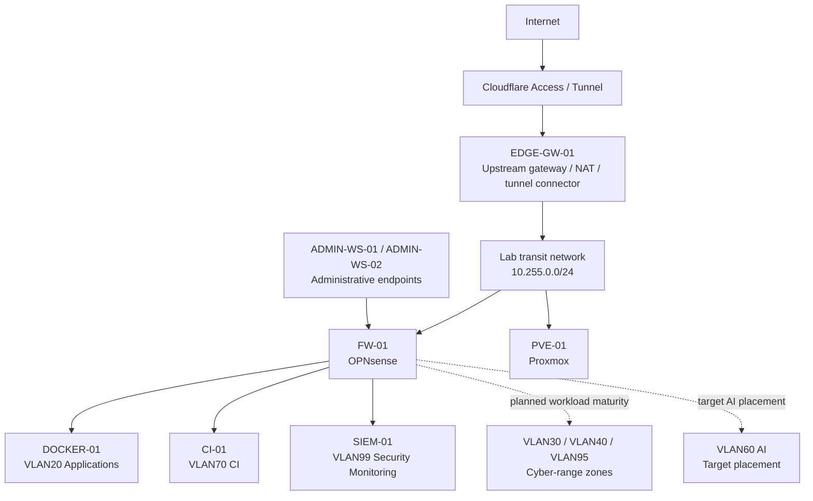
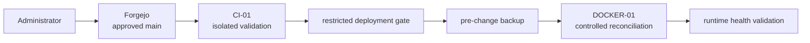

# Architecture Overview

> **Status:** Current public architecture with documented open hardening and roadmap items. Operational identifiers and addressing are intentionally sanitized.

## Purpose

This document describes the high-level architecture of a security-focused homelab designed as a small enterprise-inspired environment rather than a flat self-hosting network.

The architecture separates routing, application hosting, CI/CD, monitoring, administration, backup, and future cyber-range workloads into explicit trust domains.

## Architectural Model



Solid paths represent current architectural relationships. Dashed paths indicate configured or planned zones whose workload maturity is not claimed as complete.

## Core Roles

### EDGE-GW-01

The edge gateway provides the transport boundary between the upstream network and the isolated lab transit network. Its current responsibilities include outbound NAT and the primary Cloudflare Tunnel connector used by normal public application ingress and Wazuh administrative ingress.

It is not the inter-VLAN firewall and must not become a broad bypass around segmentation.

### FW-01

OPNsense is the authoritative inter-zone router and firewall. VLAN workloads use the firewall as their default gateway. Policy is based on explicit infrastructure requirements, approved inter-zone exceptions, controlled egress, and default-deny behavior.

### PVE-01

Proxmox hosts virtualized infrastructure and provides the VLAN-aware virtual switching required to place workloads into their assigned security zones.

### DOCKER-01

The production application host resides in VLAN20. External application access follows:

```text
Internet
  -> Cloudflare Access
  -> Cloudflare Tunnel
  -> EDGE-GW-01
  -> FW-01
  -> Caddy on DOCKER-01
  -> internal Docker network
  -> application
```

Application containers are not expected to publish arbitrary host ports. Caddy remains the normal HTTP publisher.

### CI-01

The CI runner resides in VLAN70 and is treated as untrusted remote-code-execution infrastructure.

The runner:

- has constrained execution capacity;
- uses isolated Docker-in-Docker execution;
- does not receive the production Docker socket;
- is not a bastion;
- reaches production only through controlled deployment mechanisms.

### SIEM-01

Wazuh resides in VLAN99 and receives endpoint-agent telemetry plus selected network/security logs. The Wazuh platform is operational, but recovery, retention/capacity, alert tuning, notification design, and selected hardening remain maturity work.

### Administrative Workstations

Two independent Windows administration workstations use separate local credentials and Git clones. Their private SSH key material is not synchronized between devices, enabling per-device revocation.

One workstation also hosts the current Windows-native local AI runtime and the independent infrastructure backup tier. These are separate logical roles even though they share a physical host.

## Infrastructure-as-Code Flow



The architecture deliberately separates **approval of desired state** from **authority to modify production**.

## Recovery Flow

```text
application state
  -> application-consistent staging
  -> database logical dumps / archives
  -> integrity manifest
  -> encrypted transport to independent backup tier
  -> Restic snapshot
  -> periodic isolated restore validation
```

The production host must not silently fall back to local storage when the external backup tier is unavailable.

## Local AI Boundary

The current local AI environment runs on the Windows administration/compute host, not in VLAN60.

Current controls include:

- Ollama bound to `127.0.0.1`;
- Hermes dashboard bound to `127.0.0.1`;
- remote administrative access through Cloudflare Access/Tunnel;
- model-facing tool exposure constrained to a read-only MCP service;
- MCP roots limited to approved derived knowledge and observation trees;
- no MCP shell, browser control, infrastructure action, arbitrary host-path access, or write/delete/rename capability.

VLAN60 remains the intended future placement and is not represented as current runtime.

## Design Consequences

The architecture intentionally accepts additional components and explicit routing in exchange for:

- smaller trust domains;
- independently testable failure boundaries;
- narrow firewall rules;
- controlled deployment authority;
- recoverability;
- reduced credential sharing;
- clearer troubleshooting;
- stronger portfolio evidence of security engineering tradeoffs.

## Related Documentation

- [Network Segmentation](network-segmentation.md)
- [Trust Boundaries](trust-boundaries.md)
- [Security Design Principles](security-design-principles.md)
