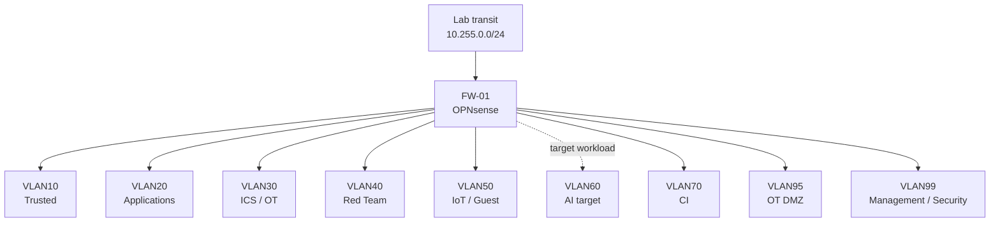

# Network Segmentation

> **Status:** Current VLAN architecture with documented target hardening. A configured VLAN does not imply that every planned workload in that zone is fully implemented.

## Purpose

The network is segmented into security zones routed by OPNsense. The goal is to prevent the lab from becoming a flat trusted network and to make east-west access explicit, reviewable, and testable.

## Public Addressing Model

The addresses below are documentation-only substitutions.

| VLAN | Public subnet | Zone | Current interpretation |
|---:|---|---|---|
| 10 | `10.100.10.0/24` | Trusted | Configured |
| 20 | `10.100.20.0/24` | Applications / Docker | Active production zone |
| 30 | `10.100.30.0/24` | ICS / OT | Configured security zone; cyber-range completion is later program work |
| 40 | `10.100.40.0/24` | Red Team | Configured security zone; exercise integration remains later program work |
| 50 | `10.100.50.0/24` | IoT / Guest | Configured |
| 60 | `10.100.60.0/24` | AI | Intended AI security zone; current AI runtime remains Windows-native elsewhere |
| 70 | `10.100.70.0/24` | CI | Active isolated runner zone |
| 95 | `10.100.95.0/24` | OT DMZ | Configured |
| 99 | `10.100.99.0/24` | Management / Security | Active security-monitoring zone |

The public convention uses `10.100.<VLAN>.1` for the firewall interface.

## Routing Boundary



OPNsense is the routing authority between zones. The edge gateway provides upstream transport and NAT but is not used as a general-purpose lateral router.

## Firewall Policy Model

Permanent policy follows an ordered model:

1. required local infrastructure access;
2. explicitly approved inter-zone access;
3. explicit private-network isolation where required;
4. controlled Internet egress;
5. default deny.

Broad rules such as `zone net -> any` are not acceptable permanent substitutes for dependency analysis.

## Representative Exceptions

The design permits narrow exceptions when a dependency is justified. Examples include:

- CI reaching the Git service over the required internal TLS path;
- CI reaching the restricted production deployment interface;
- the backup-only source identity reaching the external backup tier over TCP/445;
- Wazuh agents reaching the SIEM on the required enrollment/telemetry ports;
- the tunnel connector reaching approved application or Wazuh origins;
- internal DNS/NTP access required by specific workloads.

The public repository intentionally omits live addresses and account identities while preserving the source/destination/port design.

## CI Isolation

VLAN70 is treated as a security boundary because CI workflows can execute repository-controlled code.

Expected negative behavior includes denial of arbitrary runner-initiated access toward application, ICS/OT, Red Team, AI, OT DMZ, and management zones except for explicitly approved destinations.

The CI runner is not a bastion and does not receive the production Docker socket.

## ICS / OT and Red Team Zones

VLAN30, VLAN40, and VLAN95 exist in the segmentation architecture, but the public documentation distinguishes **network-zone existence** from **cyber-range completion**.

Future acceptance requires explicit positive and negative traffic testing. Unsolicited lateral access into ICS/OT or production/management zones is not an intended baseline.

## AI Zone

VLAN60 exists as the intended long-term AI trust zone. The current AI runtime remains Windows-native and therefore must not be depicted as already migrated into this zone.

The future migration requires explicit allowed/denied policy validation before documentation status can change.

## Validation Philosophy

Segmentation is accepted through both successful and failed tests.

Positive examples:

```text
required DNS works
required NTP works
approved application ingress works
approved CI-to-Git path works
approved backup path works
approved Wazuh telemetry works
```

Negative examples:

```text
CI cannot browse arbitrary private zones
Red Team cannot reach production without an exercise-specific exception
ICS/OT is not generally reachable from application or AI zones
application workloads cannot reach management services without justification
```

Troubleshooting must inspect addressing, VLAN tagging, routing, DNS, firewall ordering, and service state before broadening policy.

## Change Control

Before significant firewall changes:

1. verify current service health;
2. preserve the firewall configuration;
3. verify console/recovery access;
4. take a hypervisor snapshot when risk justifies it;
5. change one dependency or rule group at a time;
6. validate required traffic;
7. validate expected blocked traffic;
8. retain rollback until the change is accepted.

Disabling the firewall is not a normal troubleshooting strategy.

## Related Documentation

- [Architecture Overview](architecture-overview.md)
- [Trust Boundaries](trust-boundaries.md)
- [Security Design Principles](security-design-principles.md)
