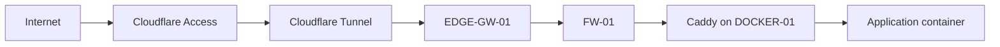
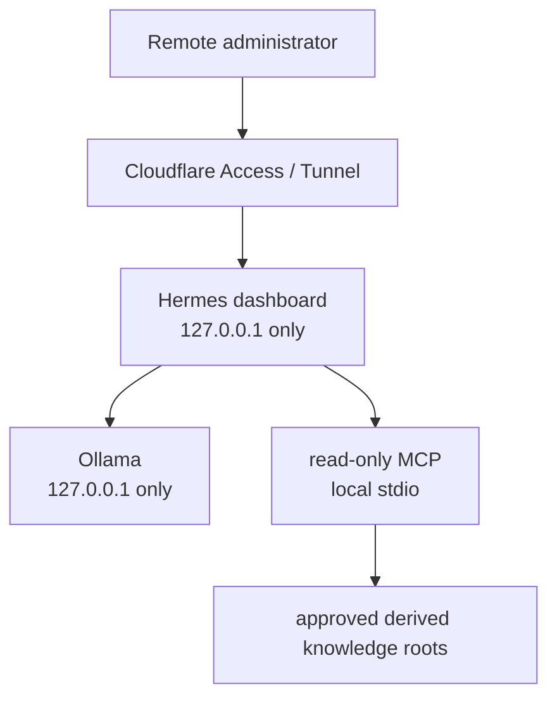

# Trust Boundaries

> **Status:** Current trust model with selected hardening and maturity work still open.

## Purpose

This document defines the major privilege and data-flow boundaries in the environment.

A trust boundary is treated as a place where identity, network policy, process privilege, data authority, or recovery authority changes.

## Boundary Summary

| Boundary | Primary control | Security objective |
|---|---|---|
| Internet -> applications | Cloudflare Access/Tunnel | Avoid public router exposure |
| Edge -> internal zones | OPNsense | Enforce inter-zone policy |
| Reverse proxy -> containers | Docker networks + Caddy | Avoid arbitrary host-port exposure |
| Developer -> source of truth | Forgejo workflow | Review desired state before production |
| CI -> production | isolated runner + restricted deployment gate | Prevent CI from becoming production root |
| Production -> backup | narrow encrypted SMB + mount guard | Preserve independent recovery tier |
| Endpoint/log source -> SIEM | narrow agent/syslog policy | Collect telemetry without creating broad management access |
| Admin workstation -> infrastructure | device-local SSH trust | Support per-device credential revocation |
| Local AI -> knowledge | read-only MCP | Prevent model tools from becoming a control plane |
| AI remote administration -> local AI | Access/Tunnel + loopback listeners | Preserve zero public ports and no LAN bind |

## Public Application Boundary

Normal application ingress follows:



The external identity boundary is handled before traffic reaches the private application zone.

Caddy is the normal application HTTP publisher. Application containers remain internal unless a separate architecture decision justifies host publication.

The Caddy design deliberately avoids mounting the Docker socket for service discovery.

## CI / Production Boundary

CI is intentionally considered hostile-capable execution infrastructure.

```text
repository workflow
  -> isolated CI runner
  -> validation
  -> restricted deployment request
  -> forced deployment command
  -> approved main SHA verification
  -> pre-deployment backup
  -> production reconciliation
  -> health check / rollback
```

The security property is:

```text
CI may validate and request an approved deployment.
CI must not receive unrestricted production control.
```

Controls include:

- isolated VLAN placement;
- constrained runner capacity;
- Docker-in-Docker execution;
- no production Docker socket;
- no unrestricted production shell;
- restricted deployment identity;
- forced command;
- verification that the requested revision matches approved main;
- backup before state-changing reconciliation;
- runtime validation and rollback.

## Backup Boundary

Production backup crosses into a separate recovery tier.

The design uses:

- a dedicated backup network identity;
- a narrow TCP/445 exception;
- SMB 3.1.1 encryption;
- root-controlled credentials on Linux;
- a fail-closed mount guard;
- application-aware staging;
- database logical dumps where required;
- integrity manifests;
- Restic snapshots;
- isolated restore testing.

The system must fail rather than silently redirect backup data onto production-local storage.

This boundary exists because versioning on the same storage tier is not sufficient disaster recovery.

## Administrative Boundary

Administrative workstations use independent local SSH key material. Git working copies are also independent.

This prevents one administrative endpoint from becoming the credential source of truth for another and supports device-specific revocation.

The Raspberry Pi transit role is intentionally limited: it is used for specific infrastructure paths and is not a universal bastion. Production Docker and CI administration use their approved direct paths instead.

Some server-side SSH hardening remains an open item and is not represented as universally complete.

## SIEM Boundary

Wazuh occupies the management/security zone.

Telemetry is permitted through explicit agent or syslog paths. Wazuh monitoring does not justify broad access from monitored zones into the management zone, and the SIEM server is not intended to become a general lateral-management host.

The SIEM platform is operational, while recovery, capacity/retention, alert tuning, notification design, and selected hardening remain maturity work.

## Local AI Boundary

The current AI architecture is intentionally constrained:



The read-only MCP exposes only approved list/read/search functionality. It does not provide shell access, write/delete/rename functions, browser/desktop control, scanning, arbitrary host-path reads, or infrastructure actions.

Retrieved content is treated as untrusted data rather than operational authority.

The current AI runtime is not claimed to reside on VLAN60.

## Trust-Boundary Validation

Controls are validated through expected-success and expected-failure tests.

Examples of expected failures include:

- CI requesting an interactive production shell;
- CI initiating arbitrary east-west traffic;
- applications bypassing the reverse-proxy model through unapproved host ports;
- backup workflows proceeding when the independent mount is invalid;
- AI tooling writing into source knowledge or executing host commands;
- Red Team or ICS/OT zones reaching protected networks without explicit authorization.

## Related Documentation

- [Architecture Overview](architecture-overview.md)
- [Network Segmentation](network-segmentation.md)
- [Security Design Principles](security-design-principles.md)
