# GitOps and Isolated CI/CD

> **Status:** Current architecture with documented hardening items. CI validation and restricted deployment are implemented; selected SSH and reproducibility hardening remains open.

## Purpose

This document describes the source-control, CI, approval, and production-reconciliation model.

The primary design requirement is:

```text
CI may validate and request a deployment.
CI must not receive unrestricted production control.
```

## Architecture

```mermaid
flowchart LR
    Dev["ADMIN-WS-01 / ADMIN-WS-02"]
    Forgejo["Forgejo<br/>approved desired state"]
    CI["CI-01<br/>isolated runner"]
    Gate["restricted deployment gate"]
    Backup["pre-deployment backup"]
    Prod["DOCKER-01<br/>controlled reconciliation"]
    Health["health validation"]
    Rollback["automatic rollback on failure"]

    Dev --> Forgejo
    Forgejo --> CI
    CI --> Gate
    Gate --> Backup
    Backup --> Prod
    Prod --> Health
    Health -->|"failure"| Rollback
    Health -->|"pass"| Prod
```



## Repository Authority

The Git service is the authoritative desired-state source for repository-managed infrastructure.

Normal workflow:

```text
feature branch
  -> pull request
  -> CI validation
  -> review / branch protection
  -> merge to main
  -> controlled production reconciliation
```

`main` represents approved desired state.

The production Compose tree is not treated as a normal developer working copy and is not routinely edited through remote shell or VS Code.

## Independent Workstation Clones

Each administration workstation maintains its own local clone.

Git is the synchronization mechanism.

Private repositories are not synchronized by:

- SMB;
- OneDrive;
- Syncthing;
- manual filesystem mirroring.

This keeps Git metadata and working-tree state independent per workstation.

## CI Security Boundary

The runner is treated as remote-code-execution infrastructure.

Required properties:

- isolated VLAN70 placement;
- repository-scoped registration;
- intentionally constrained runner capacity;
- Docker-in-Docker execution;
- no production Docker socket;
- no unrestricted production shell;
- no host bind mounts from arbitrary workflows;
- no bastion role;
- no management-zone role;
- rebuildable rather than authoritative.

A compromised runner is expected to be revoked and rebuilt, not cleaned in place and returned to service.

## Network Dependencies

The runner receives only deliberate dependencies, including:

```text
DNS -> FW-01
NTP -> FW-01
Git web/API -> approved internal TLS path
restricted deployment -> DOCKER-01 SSH endpoint
required package/action sources -> controlled Internet egress
```

General access toward application, ICS/OT, Red Team, AI, OT DMZ, and management networks is denied unless separately justified.

## Restricted Production Deployment

CI uses a dedicated constrained deployment identity.

The deployment key is restricted by source and forced command.

The deployment gate accepts only the expected deployment request form and hands off to a controlled reconciler.

The reconciler performs the following sequence:

```text
requested revision
  -> verify revision equals approved origin/main
  -> run authoritative production backup
  -> validate Compose/configuration
  -> reconcile allowed application stacks
  -> validate runtime health
  -> record success
```

On failure:

```text
deployment failure
  -> restore prior production Git state
  -> reapply prior known-good Compose
  -> validate recovery
  -> record failed revision
```

The deployment path is designed to prevent an arbitrary workflow command from becoming root shell access.

## Control-Plane Boundary

Application-stack reconciliation and CI validation are intentionally separated from high-risk control-plane changes.

Changes affecting areas such as deployment-gate logic, credentials, trust roots, CI registration, or equivalent security-critical control surfaces require tighter review and are not assumed to be automatically deployed simply because they reach `main`.

## Backup Dependency

Production reconciliation depends on the authoritative external backup tier.

A deployment does not proceed past the state-changing boundary if the required backup cannot be completed.

This links CI/CD safety to the recovery architecture rather than treating backup as an unrelated nightly task.

## Validation

### Source-control workflow

Required outcomes:

```text
feature branch created
intended diff reviewed
pull request created
CI validation passes
review/approval occurs
merge reaches main
workstation returns to clean main
```

### CI boundary

Required negative outcomes:

```text
CI -> production Docker socket: unavailable
CI -> unrestricted production shell: unavailable
CI -> general management zone: denied
CI -> unrelated private zones: denied
```

### Deployment boundary

Test inputs should confirm that malformed deployment requests are rejected and that the gate accepts only the supported request shape.

### Rollback

Controlled failure testing should use a low-risk workload. A deliberately unhealthy deployment should be detected and rolled back to the prior known-good production state.

## Runner Compromise Recovery

If runner compromise is suspected:

1. disable the runner;
2. revoke runner registration material;
3. revoke the deployment credential;
4. remove the production authorization entry;
5. isolate or destroy the runner VM;
6. rebuild from a known-clean baseline;
7. generate new deployment credentials;
8. re-register a repository-scoped runner;
9. revalidate VLAN70 policy;
10. revalidate the restricted deployment path.

## Open Hardening Items

The current architecture must not be described as universally hardened beyond validated evidence.

Tracked items include selected runner/server SSH settings and broader reproducibility/hardening work.

Branch protection should also be periodically verified in the Git service rather than inferred from workflow files alone.

## Security Considerations

Never place the following in Git:

- runner registration tokens;
- deployment private keys;
- production private keys;
- private CA keys;
- database passwords;
- application secrets;
- backup credentials;
- administrative private keys.

## Lessons Learned

CI/CD security depends less on whether a pipeline is "automated" and more on the authority granted to it.

Separating validation from production control allows the environment to gain automation while retaining an auditable approval and recovery boundary.

## Related Documentation

- [Architecture Overview](../architecture/architecture-overview.md)
- [Trust Boundaries](../architecture/trust-boundaries.md)
- [Network Segmentation](../architecture/network-segmentation.md)
- [Zero Trust Ingress](../platform/zero-trust-ingress.md)
- [Backup and Recovery Architecture](../recovery/backup-recovery-architecture.md)
- [SSH Trust Model](../security/ssh-trust-model.md)
