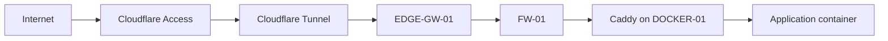
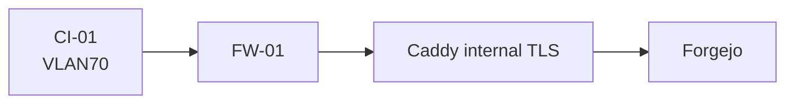
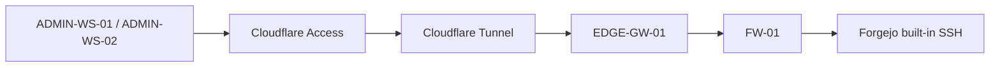

# Zero Trust Ingress

> **Status:** Current verified public architecture. Operational identifiers and addressing are intentionally sanitized.

## Purpose

This document describes how externally initiated application and administrative traffic enters the environment without exposing inbound router ports.

The design separates three paths that serve different trust purposes:

1. public web application ingress;
2. internal CI-to-Git service traffic;
3. Git-over-SSH for administrators.

These paths are intentionally not collapsed into one generic reverse-proxy flow.

## Public Application Path



The edge connector initiates the tunnel outbound. No inbound port-forward is required on the upstream router.

Cloudflare provides the external HTTPS and identity boundary. Inside the lab, OPNsense permits only the required connector-to-origin path.

## Reverse-Proxy Boundary

Caddy is the normal application HTTP publisher.

Design requirements:

- application web ports remain internal unless explicitly justified;
- the reverse proxy is attached only to required Docker networks;
- host listeners bind only where the architecture requires them;
- the Caddy admin API remains disabled;
- the Docker socket is not mounted into Caddy;
- static routing is preferred over giving the proxy host-equivalent Docker control.

This deliberately trades automatic container discovery for a smaller privilege boundary.

## CI-to-Git Service Path

The CI runner does **not** traverse the external Cloudflare application path for normal Forgejo workflow traffic.



The CI runner reaches the Git service through an explicitly approved internal TLS path.

Security properties:

- the runner receives only the destination/port required for Git/API workflow traffic;
- the runner does not receive general application-zone access;
- the internal trust anchor is public certificate material only;
- the private CA key is never copied to CI.

This keeps CI independent of browser-oriented Cloudflare Access while preserving authenticated TLS internally.

## Administrator Git SSH Path

Git SSH is a third path.



Git SSH does not terminate at Caddy.

The Git transport listener is also distinct from administrative SSH on the Docker host. This separation prevents a source-control transport path from becoming an accidental management path.

## Security Model

The ingress design follows these rules:

```text
public router ports: none
inter-zone firewall: FW-01
normal HTTP publisher: Caddy
application host ports: minimized
Caddy Docker socket: absent
Caddy admin API: disabled
Git web/API traffic: reverse proxied
Git SSH traffic: dedicated service path
CI workflow traffic: internal approved TLS path
```

## Dependencies

Current application ingress depends on:

- Cloudflare Access policy;
- Cloudflare Tunnel health;
- the edge connector;
- routing from `EDGE-GW-01` toward the application zone;
- the OPNsense ingress exception;
- the Caddy listener and route;
- Docker network membership;
- the target application.

A connected Cloudflare Tunnel does not prove that the origin path is healthy.

## Validation

### Public web application

Validate in layers:

1. Cloudflare Tunnel is connected.
2. `EDGE-GW-01` resolves and routes to the sanitized application-zone origin.
3. `FW-01` permits only the intended connector-to-origin flow.
4. Caddy responds for the expected virtual host.
5. Caddy resolves the container upstream.
6. the application responds on its Docker network.

### CI-to-Git

Required outcomes:

```text
CI -> Git web/API path: PASS
CI -> arbitrary application-zone host/port: FAIL
CI -> management zone without exception: FAIL
```

### Git SSH

Required outcomes:

```text
administrator -> Git SSH through Access: PASS
interactive shell on Git transport identity: unavailable
Git SSH path -> Docker administrative SSH: not conflated
```

## Troubleshooting

When an origin fails, inspect in dependency order:

```text
DNS
Cloudflare Access/Tunnel
edge connector health
route toward application zone
OPNsense rule
host listener
Caddy configuration
Docker network membership
upstream container health
```

Do not respond to a `502` or origin timeout by publishing the application port directly.

Do not compensate for a missing edge route with broad NAT or firewall rules.

## Rollback / Recovery

For ingress changes:

1. preserve the last known-good Caddy configuration;
2. validate configuration syntax before reload;
3. keep previous Cloudflare route definitions available for rollback;
4. change one route or virtual host at a time;
5. verify both intended access and unintended-access denial;
6. revert the smallest changed layer when validation fails.

## Security Considerations

The design avoids several common privilege escalations:

- no public router forwarding;
- no Docker socket in the reverse proxy;
- no direct publication of routine application ports;
- no CI dependence on the public browser-access path;
- no reuse of Docker administrative SSH for Git transport;
- no broad edge-gateway bypass around OPNsense.

## Lessons Learned

A "single ingress path" is not always the safest design. Web applications, CI service traffic, and Git SSH have different identity and transport requirements. Treating them separately allows each path to receive the minimum privileges it needs.

## Related Documentation

- [Architecture Overview](../architecture/architecture-overview.md)
- [Network Segmentation](../architecture/network-segmentation.md)
- [Trust Boundaries](../architecture/trust-boundaries.md)
- [Security Design Principles](../architecture/security-design-principles.md)
- [GitOps and Isolated CI/CD](../devops/gitops-ci-cd.md)
