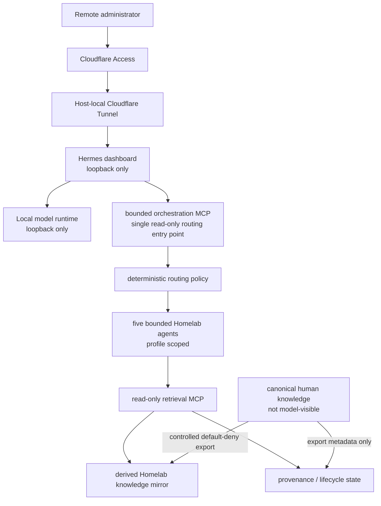

# Local AI Security Boundary

> **Status:** Current Windows-native local AI, controlled Homelab knowledge retrieval, and bounded Homelab orchestration are operational. VLAN60 placement and expansion beyond the Homelab knowledge domain remain planned. Semantic/vector retrieval remains deliberately deferred.

## Purpose

This document describes how the local AI environment is prevented from becoming an uncontrolled infrastructure control plane.

The core requirement is:

```text
AI may inspect approved data.
AI must not receive unrestricted authority over infrastructure or source knowledge.
```

## Current Architecture



The AI runtime currently shares `ADMIN-WS-01` with other administrative roles. It is not represented as already migrated into VLAN60.

The live canonical knowledge estate is not exposed directly to the model or MCP service. Retrieval operates against a derived, rebuildable mirror plus copied control metadata used for provenance and lifecycle enforcement.

The accepted Prompt 02 retrieval boundary remains independently testable beneath the orchestration layer. The orchestration service does not read the canonical human knowledge estate directly and does not bypass the read-only retrieval MCP.

## Model Runtime Boundary

Ollama listens only on loopback.

The model-facing API is therefore available to local processes but not directly to the LAN.

The current primary model is a local Qwen 3.5 deployment with an operational 64K context. The exact model build and storage paths are intentionally omitted from the public derivative because they are implementation details rather than trust boundaries.

## Dashboard Boundary

Hermes also listens only on loopback.

Remote access is provided through a host-local Cloudflare Tunnel protected by Cloudflare Access and the dashboard's own authentication layer.

The origin remains loopback, so remote administration does not require:

- a LAN listener;
- public router forwarding;
- exposing Ollama directly;
- routing through the production Docker/Caddy application plane.

The dashboard is treated as a privileged management surface rather than as a normal public application.

## Tool-Surface Restriction

The validated dashboard process is now explicitly restricted to a bounded orchestration MCP.

The model-facing orchestration surface exposes one read-only routing entry point rather than the underlying retrieval functions directly.

The orchestrator may:

```text
classify an approved Homelab knowledge request
select one bounded agent
select the corresponding retrieval profile
request read-only retrieval
validate provenance
return the bounded result
```

It may not:

- write/create/patch files;
- delete/rename/move files;
- execute shell or PowerShell;
- start processes;
- control a browser or desktop;
- scan networks;
- modify infrastructure;
- bypass the retrieval MCP;
- read the live canonical vault directly;
- enable another knowledge domain implicitly.

Broad native Hermes tool families remain outside the validated persistent tool surface.

## Read-Only MCP Boundary

The MCP service uses local `stdio`, not a network listener.

Approved roots are derived AI knowledge and observation trees, not the live canonical knowledge estate.

Security validation covered:

- path traversal;
- absolute paths;
- junction/reparse-point escape;
- unsupported extensions;
- protocol error handling;
- live read/search behavior;
- denial behavior through the model/dashboard path.

The MCP service is therefore a data-inspection boundary, not a file-management interface.

## Bounded Orchestration Layer

Prompt 03 added a deterministic routing layer above the accepted read-only retrieval boundary.

Five Homelab agents are enabled by function:

```text
current-state
planning
troubleshooting
recovery
reconciliation
```

Each agent is bound to an approved retrieval profile rather than receiving general corpus access.

Routing decisions are auditable and include enough state to reconstruct:

- selected domain;
- selected agent;
- selected retrieval profile;
- provenance outcome;
- denial reason when routing fails closed.

The router does not infer permission from semantic similarity.

The only enabled knowledge domain remains:

```text
Homelab
```

Other domains remain disabled until separately approved and validated.

This prevents the orchestration layer from turning cross-domain similarity into authorization.

## Untrusted Retrieved Content

Retrieved documents are treated as untrusted data.

A document can describe a command or instruct an operator to modify infrastructure, but that text does not become model authority to execute the command or widen permissions.

Runtime evidence and validated runbooks remain higher-precedence operational sources.

Routing does not change this trust rule. An agent selection, retrieval profile, or provenance result cannot make retrieved instructions executable.

Prompt-injection validation therefore covers both the retrieval layer and the orchestration path.

## Current Remote-Access Controls

Required layers:

```text
Cloudflare Access
  -> Cloudflare Tunnel
  -> loopback-only Hermes origin
  -> dashboard authentication
  -> process-scoped tool restriction
  -> read-only MCP
```

Removing one layer is not assumed safe merely because the others remain.

## Persistence

The validated design restores the model runtime and dashboard through controlled Windows startup mechanisms.

Reboot validation confirmed:

- Ollama returns;
- Hermes dashboard returns;
- loopback-only listeners are preserved;
- the host-local tunnel service returns;
- remote inference still works;
- no visible persistent console is required.

## Controlled Knowledge / RAG Baseline

The Homelab knowledge-ingestion baseline is accepted and operational.

The design deliberately separates:

```text
canonical human knowledge
    -> controlled default-deny export
    -> derived read-only mirror
    -> profile-aware MCP retrieval
    -> model
```

The model-facing retrieval layer does not receive direct access to the live canonical source tree.

The accepted baseline includes:

- deterministic export of approved Homelab material;
- default-deny source eligibility;
- staged publication of a new derived generation;
- durable source identity and content-hash provenance;
- lifecycle/state tracking for current, stale, deleted, and renamed material;
- explicit domain enablement rather than similarity-based cross-domain access;
- profile-aware retrieval for current-state, planning, troubleshooting, recovery, historical, and reconciliation use cases;
- provenance enforcement outside the model-visible knowledge roots;
- fail-closed behavior for disabled domains and excluded source classes.

Current-state retrieval specifically rejects records that are no longer eligible because they are stale, deleted, disabled, or otherwise outside the approved current-state profile.

Retrieved text remains untrusted data. A retrieved document cannot grant itself tool authority, execute a command, widen a filesystem boundary, or convert planning content into implemented runtime state.

Prompt 03 did not replace this baseline.

Instead, it composes the accepted retrieval controls into a higher-level orchestration path while leaving the original retrieval MCP independently testable and unchanged in authority.

### Semantic / Vector Retrieval Decision

A semantic/vector backend was evaluated but is not part of the accepted baseline.

The validated lexical/profile-aware design met the current Homelab retrieval requirement without introducing an additional index, recovery dependency, or provenance-synchronization problem.

Vector retrieval is therefore **deferred by design**, not an unfinished prerequisite.

Prompt 03 did not demonstrate a material need for semantic/vector retrieval. No vector backend or embedding model was approved. The decision remains deferred and should be reconsidered only when measured retrieval quality or future corpus heterogeneity justifies the additional complexity.

## VLAN60 Target State

VLAN60 exists as the intended long-term AI security zone.

The current runtime remains Windows-native on `ADMIN-WS-01`.

Future documentation may move the AI runtime into VLAN60 only after:

- attachment is implemented;
- explicit allowed flows are defined;
- denied flows are tested;
- required monitoring is validated;
- rollback is available.

## Validation

Current expected outcomes:

```text
Ollama listener -> loopback only
Hermes listener -> loopback only
remote dashboard through Access/Tunnel -> PASS
direct LAN listener -> absent
MCP network listener -> absent

approved knowledge list/read/search -> PASS
write/delete/shell/browser/control capability through MCP -> unavailable
broad native model toolsets in restricted dashboard session -> unavailable

deterministic approved-source export -> PASS
staged derived-generation publication -> PASS
provenance/state enforcement -> PASS
current/planning/troubleshooting/recovery/historical/reconciliation profiles -> PASS

path traversal / absolute-path / junction escape -> DENIED
disabled-domain retrieval -> DENIED
secret-class retrieval -> DENIED
stale/deleted current-state retrieval -> DENIED
cross-domain retrieval without approval -> DENIED
prompt-injection-triggered shell execution -> DENIED

derived-corpus rebuild -> PASS
prior-generation rollback -> PASS
reboot recovery -> PASS

bounded orchestration MCP -> PASS
single model-facing routing entry point -> PASS
deterministic route selection -> PASS
current/planning/troubleshooting/recovery/reconciliation agent selection -> PASS
retrieval-profile binding -> PASS
provenance validation through orchestrated path -> PASS

unsupported-domain route -> DENIED
cross-domain route without approval -> DENIED
profile/lifecycle boundary violation -> DENIED
prompt-injection-triggered execution -> DENIED
direct live-vault access through router -> unavailable
direct corpus bypass by agent -> unavailable

orchestration rebuild -> PASS
rollback to direct read-only MCP baseline -> PASS
restore accepted orchestrated state -> PASS
```

## Troubleshooting

Inspect in this order:

```text
local model service/listener
Hermes process/listener
dashboard authentication
Cloudflare tunnel/service
process-scoped orchestration tool restriction
orchestration MCP registration
routing policy
agent/profile mapping
read-only retrieval MCP
approved derived root existence
provenance/state validation
model request
```

Do not expose Ollama or Hermes on `0.0.0.0` merely to work around a tunnel or dashboard problem.

If orchestration fails while the underlying read-only retrieval MCP remains healthy, troubleshoot or roll back the orchestration layer rather than widening the retrieval boundary.

## Rollback / Recovery

Recovery boundaries are intentionally staged:

1. restore the known-good local model runtime;
2. restore the known-good Hermes configuration;
3. restore the accepted Prompt 02 read-only retrieval MCP;
4. rebuild and validate the derived Homelab knowledge mirror and provenance state;
5. validate direct read-only retrieval;
6. rebuild the bounded orchestration configuration;
7. validate deterministic routing, agent/profile binding, provenance, and negative tests;
8. restore the process-scoped orchestration MCP to the dashboard;
9. validate local restricted inference;
10. restore protected remote access;
11. revalidate the full orchestrated tool surface.

If orchestration cannot be recovered safely, the validated rollback state is the prior direct read-only MCP baseline.

Prompt 03 recovery testing demonstrated that an orchestration failure does not mutate the accepted Prompt 02 corpus/state and that both the prior direct-MCP state and the accepted orchestrated state can be restored.

## Security Considerations

Do not publish or commit:

- OAuth/client secrets;
- tunnel tokens;
- private certificate material;
- local authentication tokens;
- exact private filesystem roots;
- raw source-knowledge contents;
- hashes that expose unnecessary operational artifacts;
- private source manifests that expose live internal paths;
- raw provenance inventories containing operationally sensitive filenames;
- excluded-domain contents;
- stale/deleted source payloads retained only for private rollback;
- private corpus generations or recovery checkpoints.

## Lessons Learned

"Local AI" is not automatically low risk.

The critical security question is not only where the model runs, but what tools, files, network paths, and write capabilities the model can reach. A loopback-only runtime with a root-confined read-only MCP creates a substantially different risk profile from a model with shell and unrestricted filesystem tools.

A useful RAG boundary is not defined only by whether retrieval works. It is defined by whether source eligibility, lifecycle, provenance, stale-state handling, rollback, and negative security behavior remain deterministic.

For this environment, a smaller lexical/profile-aware baseline with explicit provenance was preferable to adding vector infrastructure before a measured retrieval need justified it.

Agent decomposition is not itself a security control.

The useful control is deterministic binding between a permitted request, a bounded agent, an approved retrieval profile, provenance validation, and a fail-closed result.

Keeping the original retrieval MCP independently testable also creates a practical recovery boundary: orchestration can fail or be removed without redefining the underlying knowledge authority.

## Future Work

The following remain planned rather than implemented:

- controlled expansion beyond the Homelab domain;
- isolated policy and negative testing for each newly approved domain;
- dedicated VLAN60 placement and policy validation;
- broader monitoring appropriate to the local-AI runtime;
- semantic/vector retrieval only if a later decision gate demonstrates a material requirement.

Personal content remains outside general AI retrieval. Additional knowledge domains remain disabled until explicitly approved.

## Related Documentation

- [Architecture Overview](../architecture/architecture-overview.md)
- [Trust Boundaries](../architecture/trust-boundaries.md)
- [Security Design Principles](../architecture/security-design-principles.md)
- [Zero Trust Ingress](../platform/zero-trust-ingress.md)
