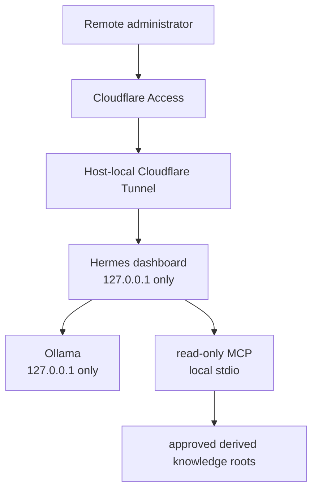

# Local AI Security Boundary

> **Status:** Current Windows-native local AI foundation is operational. VLAN60 placement and final semantic RAG/provenance/recovery work remain planned.

## Purpose

This document describes how the local AI environment is prevented from becoming an uncontrolled infrastructure control plane.

The core requirement is:

```text
AI may inspect approved data.
AI must not receive unrestricted authority over infrastructure or source knowledge.
```

## Current Architecture



The AI runtime currently shares `ADMIN-WS-01` with other administrative roles. It is not represented as already migrated into VLAN60.

## Model Runtime Boundary

Ollama listens only on loopback.

The model-facing API is therefore available to local processes but not directly to the LAN.

The current primary model is a local Qwen 3.5 deployment with an operational 64K context. The exact model build and storage paths are intentionally omitted from the public derivative because they are implementation details rather than trust boundaries.

## Dashboard Boundary

Hermes also listens only on loopback.

Remote access is provided through a host-local Cloudflare Tunnel protected by Cloudflare Access and the dashboard's own authentication layer.

The origin remains loopback, so remote administration does not require:

- a LAN listener;
- public router forwarding;
- exposing Ollama directly;
- routing through the production Docker/Caddy application plane.

The dashboard is treated as a privileged management surface rather than as a normal public application.

## Tool-Surface Restriction

The validated dashboard process is explicitly restricted to the approved read-only MCP surface.

Broad native tool families are not exposed to the validated model session.

The allowed MCP service exposes only:

```text
list approved sources
read approved knowledge file
search approved knowledge
```

It does not expose:

- write/create/patch;
- delete/rename/move;
- shell or PowerShell;
- process execution;
- browser control;
- desktop control;
- arbitrary host-path reads;
- network scanning;
- infrastructure actions.

## Read-Only MCP Boundary

The MCP service uses local `stdio`, not a network listener.

Approved roots are derived AI knowledge and observation trees, not the live canonical knowledge estate.

Security validation covered:

- path traversal;
- absolute paths;
- junction/reparse-point escape;
- unsupported extensions;
- protocol error handling;
- live read/search behavior;
- denial behavior through the model/dashboard path.

The MCP service is therefore a data-inspection boundary, not a file-management interface.

## Untrusted Retrieved Content

Retrieved documents are treated as untrusted data.

A document can describe a command or instruct an operator to modify infrastructure, but that text does not become model authority to execute the command or widen permissions.

Runtime evidence and validated runbooks remain higher-precedence operational sources.

## Current Remote-Access Controls

Required layers:

```text
Cloudflare Access
  -> Cloudflare Tunnel
  -> loopback-only Hermes origin
  -> dashboard authentication
  -> process-scoped tool restriction
  -> read-only MCP
```

Removing one layer is not assumed safe merely because the others remain.

## Persistence

The validated design restores the model runtime and dashboard through controlled Windows startup mechanisms.

Reboot validation confirmed:

- Ollama returns;
- Hermes dashboard returns;
- loopback-only listeners are preserved;
- the host-local tunnel service returns;
- remote inference still works;
- no visible persistent console is required.

## Current Data-State Limitation

The read-only MCP boundary is operational, but the final semantic RAG system is not complete.

The current public architecture must not claim completion of:

- controlled full-corpus ingestion;
- embeddings/vector retrieval;
- provenance enforcement;
- refresh/stale handling;
- vector/index recovery;
- final retrieval acceptance.

Those remain separate work.

## VLAN60 Target State

VLAN60 exists as the intended long-term AI security zone.

The current runtime remains Windows-native on `ADMIN-WS-01`.

Future documentation may move the AI runtime into VLAN60 only after:

- attachment is implemented;
- explicit allowed flows are defined;
- denied flows are tested;
- required monitoring is validated;
- rollback is available.

## Validation

Current expected outcomes:

```text
Ollama listener -> loopback only
Hermes listener -> loopback only
remote dashboard through Access/Tunnel -> PASS
direct LAN listener -> absent
MCP network listener -> absent
approved knowledge list/read/search -> PASS
write/delete/shell/browser/control capability through MCP -> unavailable
broad native model toolsets in restricted dashboard session -> unavailable
reboot recovery -> PASS
```

## Troubleshooting

Inspect in this order:

```text
Ollama service/listener
Hermes process/listener
dashboard authentication
Cloudflare tunnel/service
process-scoped tool restriction
MCP registration
MCP stdio process
approved root existence
path-policy validation
model request
```

Do not expose Ollama or Hermes on `0.0.0.0` merely to work around a tunnel or dashboard problem.

## Rollback / Recovery

Recovery boundaries are intentionally staged:

1. restore the known-good local Ollama runtime;
2. restore the known-good Hermes/Qwen configuration;
3. restore the validated read-only MCP service;
4. validate local restricted inference;
5. restore persistent dashboard startup;
6. restore protected remote access;
7. revalidate the restricted tool surface.

This prevents remote-access troubleshooting from silently changing the underlying model/data boundary.

## Security Considerations

Do not publish or commit:

- OAuth/client secrets;
- tunnel tokens;
- private certificate material;
- local authentication tokens;
- exact private filesystem roots;
- raw source-knowledge contents;
- hashes that expose unnecessary operational artifacts.

## Lessons Learned

"Local AI" is not automatically low risk.

The critical security question is not only where the model runs, but what tools, files, network paths, and write capabilities the model can reach. A loopback-only runtime with a root-confined read-only MCP creates a substantially different risk profile from a model with shell and unrestricted filesystem tools.

## Related Documentation

- [Architecture Overview](../architecture/architecture-overview.md)
- [Trust Boundaries](../architecture/trust-boundaries.md)
- [Security Design Principles](../architecture/security-design-principles.md)
- [Zero Trust Ingress](../platform/zero-trust-ingress.md)
