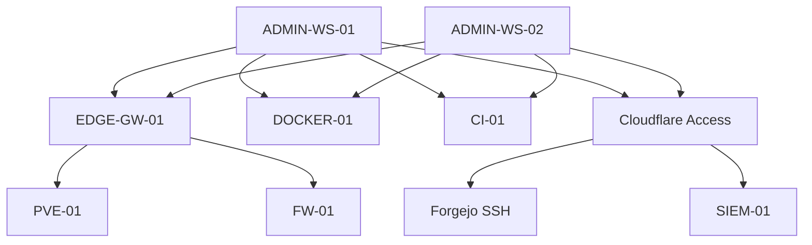

# SSH Trust Model

> **Status:** Current verified client trust paths with target server-side hardening still open on selected systems. The architecture does not claim universal key-only enforcement until negative authentication tests confirm it.

## Purpose

This document describes the administrative SSH topology and credential-isolation model.

The objective is to provide reliable management paths without turning one host into an unnecessary universal bastion or synchronizing private keys between workstations.

## Administrative Topology



## Windows OpenSSH

Windows OpenSSH is the authoritative client implementation on both administration workstations.

The design avoids parallel client trust stacks such as:

- PuTTY/Pageant-only identities;
- IDE-specific SSH private keys;
- Git-specific SSH overrides that bypass the standard SSH config.

This keeps terminal, VS Code, Git, and direct SSH behavior anchored to the same client trust model.

## Device-Scoped Credentials

Each workstation owns separate private-key material.

Required property:

```text
ADMIN-WS-01 private keys != ADMIN-WS-02 private keys
```

The workstations may use the same logical role names, but their keys are generated and revoked independently.

This enables:

```text
workstation compromise
  -> revoke that workstation's public keys
  -> preserve the other workstation's credentials
```

Private SSH directories are not synchronized between workstations.

## Restricted Jump-Host Use

`EDGE-GW-01` is used as SSH transit only for infrastructure that requires that route, principally the hypervisor and firewall.

It is not the management path for:

- the production Docker host;
- the CI runner;
- Forgejo Git SSH;
- Wazuh administrative SSH.

This keeps the edge gateway from becoming a general-purpose administrative choke point or lateral-access mechanism.

## Direct Management Paths

Production Docker and CI administration use direct approved management routes.

The CI host is never used as a bastion.

The Docker host is not administered through the edge jump host merely for convenience.

## Cloudflare-Protected SSH

Selected administrative or service SSH endpoints use Cloudflare Access with `cloudflared access ssh` as the transport mediation.

Examples include:

- Forgejo Git SSH;
- Wazuh administrative SSH;
- Windows peer administration.

This allows those services to remain free of public router port forwarding.

The Cloudflare connector may live on the destination host or an approved connector host, but connector placement does not automatically create an SSH `ProxyJump` relationship.

## Windows Peer Administration

The two Windows administration workstations support bidirectional peer SSH through host-local loopback-bound Windows OpenSSH servers and Cloudflare Access.

The peer model separates:

- standard remote-execution accounts;
- explicit privileged administrative accounts.

Neither Windows workstation becomes a transit host for infrastructure management.

## GUI Forwarding

Where management GUI forwarding is needed, local forwarding binds only to loopback on the client.

This provides a temporary administrative path without publishing the management service to the LAN or Internet.

## Client Policy vs Server Policy

A critical distinction is maintained between:

```text
client configuration requests public-key authentication
```

and:

```text
server effective configuration prohibits password authentication
```

The first does not prove the second.

Server-side hardening is considered complete only after:

1. effective configuration is inspected;
2. public-key login succeeds;
3. a deliberately disallowed authentication method fails;
4. rollback access is preserved during the change.

## Target Hardening Baseline

Where not yet validated, the target includes:

```text
public-key authentication enabled
password authentication disabled
keyboard-interactive authentication disabled
root login restricted/disabled as appropriate
X11 forwarding disabled
agent forwarding disabled
general TCP forwarding disabled unless explicitly required
```

The repository does not claim these settings are universally active.

## Validation

### Client identity

Validate that the expected OpenSSH binary and intended key are in use.

### Trust path

Expected examples:

```text
ADMIN-WS -> EDGE-GW -> PVE: PASS
ADMIN-WS -> EDGE-GW -> FW: PASS
ADMIN-WS -> DOCKER-01 direct: PASS
ADMIN-WS -> CI-01 direct: PASS
ADMIN-WS -> Cloudflare Access -> Git SSH: PASS
ADMIN-WS -> Cloudflare Access -> SIEM-01: PASS
```

Expected negative behavior:

```text
CI-01 used as bastion: not supported
Docker management through EDGE-GW merely by default: not configured
shared private key copied between workstations: prohibited
Git SSH transport yielding interactive shell: unavailable
```

## Troubleshooting

Inspect:

```text
client binary
SSH config resolution
identity selection
known-host entry
route
ProxyJump/ProxyCommand
Cloudflare Access authentication
server listener
server effective authentication policy
logs
```

Do not disable host-key checking or copy private keys between systems to resolve a trust problem.

## Rollback / Recovery

During server SSH hardening:

1. preserve a currently working session;
2. retain console or equivalent recovery access;
3. back up the server configuration;
4. test the candidate configuration;
5. reload rather than restart where supported;
6. validate public-key access in a fresh session;
7. perform a negative password-authentication test;
8. revert immediately if fresh-session access fails.

## Security Considerations

Never publish or commit:

- private keys;
- key fingerprints where they add no design value;
- actual usernames;
- raw workstation SSH config;
- exact private management hostnames.

## Lessons Learned

SSH security is a topology problem as much as an authentication problem.

Limiting which systems act as transit hosts, keeping credentials device-local, and distinguishing client preference from server enforcement prevents a convenient administrative setup from quietly becoming a lateral-movement architecture.

## Related Documentation

- [Architecture Overview](../architecture/architecture-overview.md)
- [Trust Boundaries](../architecture/trust-boundaries.md)
- [Network Segmentation](../architecture/network-segmentation.md)
- [GitOps and Isolated CI/CD](../devops/gitops-ci-cd.md)
