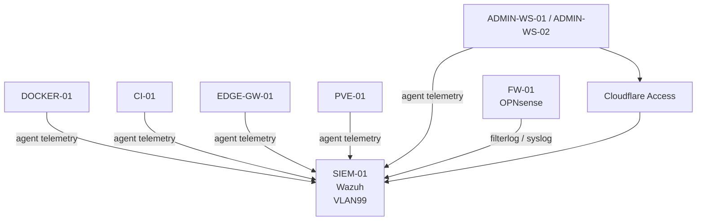

# Wazuh SIEM Architecture

> **Status:** Operational monitoring foundation established. Recovery, retention/capacity, alert tuning, notifications, and selected hardening remain maturity work.

## Purpose

This document describes the current centralized security-monitoring architecture.

Wazuh provides endpoint/security telemetry and firewall-log visibility. It does not replace OPNsense as the inter-zone security boundary and is not placed inline in production routing.

## Architecture



## Placement

`SIEM-01` resides in the management/security zone.

The host is intentionally not a general lateral-management jump host. OPNsense policy restricts the SIEM's private-network reach and allows only its required infrastructure and public-update dependencies.

## Telemetry Sources

The operational baseline includes agents on representative systems across administration, production Docker, edge/gateway, CI, and virtualization.

OPNsense forwards firewall `filterlog` events by syslog to Wazuh.

These monitoring exceptions are source-specific and do not grant broad access into the management/security zone.

## Agent Traffic

The current Wazuh architecture uses:

```text
TCP/1514 -> agent communication
TCP/1515 -> enrollment/authentication
```

Firewall rules are created per approved source zone or host rather than as a broad `any -> SIEM` policy.

## Firewall Log Ingestion

OPNsense forwards `filterlog` over UDP/514.

The stock Wazuh `pf` decoder has been validated against live OPNsense firewall events.

This provides central visibility into network-policy events without making Wazuh the enforcement device.

## Administrative Access

The dashboard and SSH administration use Cloudflare Access-protected paths.

No public router forwarding is required.

Wazuh web administration bypasses the normal Docker/Caddy application path and reaches the SIEM origin through its approved tunnel/firewall path.

This separation reflects the SIEM's role as privileged security infrastructure rather than an ordinary application container.

## Host Defense in Depth

The Wazuh host uses an Ubuntu host firewall with default-deny inbound behavior and narrow source-specific permits.

Host firewalling does not replace OPNsense segmentation; it adds a second enforcement layer around a high-value management workload.

## Routing Considerations

Monitoring introduced several explicit routes so approved telemetry sources could reach the management/security zone through OPNsense.

A notable implementation issue involved OPNsense `reply-to` behavior for sources on the same transit subnet as the firewall WAN interface.

The correct resolution was a narrow per-rule exception rather than disabling `reply-to` globally.

This is retained as an engineering lesson: firewall-policy mechanics can affect return-path behavior even when addressing and forward routing appear correct.

## Validation

Validated operational checks include:

```text
central Wazuh services active
indexer health acceptable
agent communication from approved sources
agent enrollment path available
OPNsense filterlog received over UDP/514
Cloudflare-protected dashboard reachable
Cloudflare-protected SSH reachable
host firewall permits only intended services/sources
required routes persist
```

Negative expectations include:

```text
unapproved source -> Wazuh agent ports: denied
SIEM -> arbitrary private network: denied by policy
direct public router exposure: absent
monitoring rule -> broad inter-zone access: not permitted
```

## Current Maturity Backlog

The current system is not described as a complete production SOC platform.

Remaining work includes:

- formal Wazuh configuration recovery outside the same physical host failure domain;
- index retention and capacity thresholds;
- alert-noise tuning;
- notification/escalation paths;
- additional continuity checks;
- broader monitoring coverage where justified;
- selected SSH hardening;
- future AI/ICS/OT/Red-Team telemetry under explicit zone policy.

## Troubleshooting

Inspect:

```text
source route
source firewall
OPNsense rule order
same-subnet reply-to behavior where applicable
SIEM host firewall
Wazuh listener
agent service
manager/indexer/dashboard service health
syslog target configuration
decoder/rule processing
```

Do not respond to monitoring failures by creating a general `any -> SIEM` rule.

## Recovery

The central SIEM currently has a documented operational baseline but the long-term independent recovery strategy is still an open maturity item.

This limitation is explicit in the public architecture and should not be hidden behind a generic "backed up" claim.

## Security Considerations

The SIEM contains security telemetry and administrative capability.

Public documentation therefore omits:

- live management DNS;
- real host addresses;
- raw firewall aliases;
- administrative usernames;
- private key details;
- certificate/private-key material.

## Lessons Learned

Security monitoring should consume narrow exceptions rather than becoming a reason to weaken segmentation.

A SIEM is more valuable when its telemetry paths, host firewall, routing, and recovery dependencies are treated as security architecture rather than as an isolated application install.

## Related Documentation

- [Architecture Overview](../architecture/architecture-overview.md)
- [Network Segmentation](../architecture/network-segmentation.md)
- [Trust Boundaries](../architecture/trust-boundaries.md)
- [SSH Trust Model](ssh-trust-model.md)
